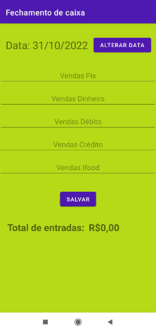

# The ideia behind the project

My mom has a small store, and she still uses paper and pen to register her sales, and thinking of it I had the idea to build this app for her to register her sales and query it automatically by date periods, instead of looking in her notebook and do the calculation the values manually.

###### Home Activity

The app starts here where the user can click a button to open the form activity, where he can insert new registers, or the other for openning the see registers activity, wich can do the queries.

###### Form Activity

In this Activity the user can insert new registers, in the top right there's a button to change the date, and bellow it the text fields to insert the values, in the bottom a button to save the register.

###### See Registers Activity

Here the user can query data filtering by periods, in the top of the screen are two text views that shows the date where the query starts and the ending date, bellow it two buttons to change these dates. The fields that follow shows the total value of sales of every kind and in the bottom a text that shows the overall value of sales in the period.
